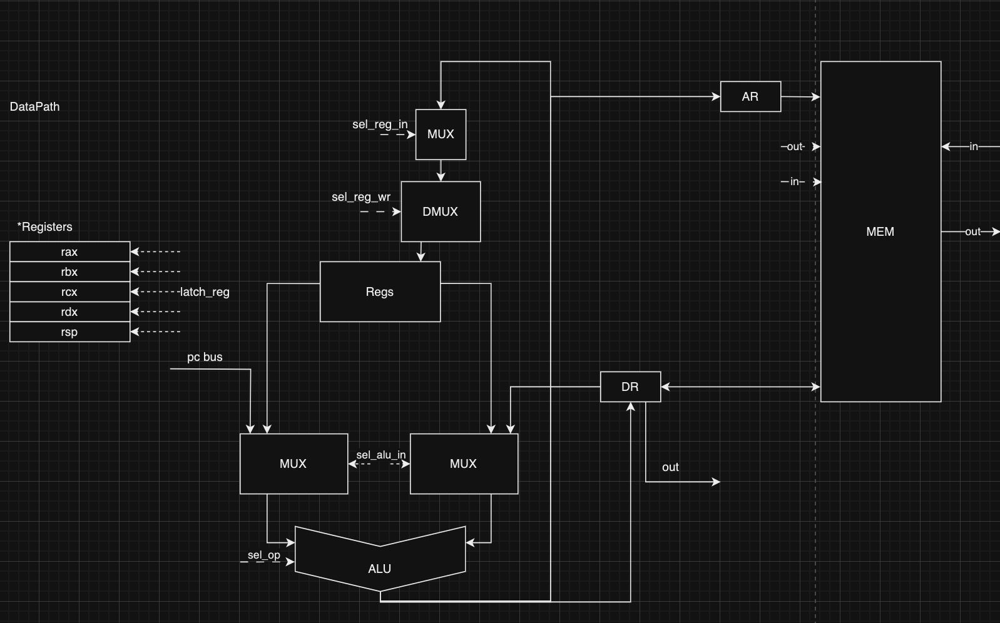

# csa-lab3

## Вариант 
| Особенность             |                                  |
|-------------------------|----------------------------------|
| alg                     | синтаксис языка должен напоминать java/javascript/lua.                               |
| cisc                    | Система команд должна содержать сложные инструкции, переменная длина машинного слова |
| neum                    | фон Неймановская архитектура.                                                        |
| hw                      | CU Реализуется как часть модели.                                                     |
| instr                   | процессор необходимо моделировать с точностью до каждой инструкции.                  |
| binary                  | бинарное представление.                                                              |
| stream                  | Ввод-вывод осуществляется как поток токенов.                                         |
| mem                     | memory-mapped                                                                        |
| cstr                    | Null-terminated (C string)                                                           |
| prob5                   |                                                                                      |


## Язык программирования 
- Грамматика:
``` ebnf
program ::= "{" <statements> "}"
statements ::= <statement> | <statement> <statements>
statement ::=  (<asign> | <if_statement> | <loop_statement> | <op>) ";"
op ::= <litteral> | <number> |
             <op> "+" <op> | 
             <op> "-" <op> |
             <op> "/" <op> |
             <op> "%" <op> |
             <op> "*" <op> |
             <op> "==" <op>|
             <op> "or" <op>|
             <op> "and" <op>|
             <op> "!=" <op>|
             "!"<op>       |
             <op>"++"      |
             <op>"--"      |
             "(" <op> ")"  |
asign ::= <type> <litteral> "="  <op>  ";"          #TODO: char and string
type ::= "int" | "char" | "string" 
if_statement ::= "if" <op> ":" "{"  <statements> { "else" ":" '{' <statements> '}' } "}"
loop_statement ::= "while" <op> ":" "{" <statements> "}"
number ::= [0-9]*
litteral ::= [a-bA-B][a-bA-B0-9]*
```
```
Машинное слово - non-fixed 32 - бит  : 
|1---   |2---   |3---  |4---  |5---  |6---  |7---  |8--- | opt:|9------- | 10------- | 11------- | 12------- | 
|    opcode     | cntrl| reg  |           adress         |     |                     value                   |
                | cntrl| reg  |           offset         |     |                     value                   |
                | cntrl| reg  | reg  |
                
```

control bits 0010 - относительная
control bits 0100 - косвенная
constrol bits mov 1001 - reg -> adress
-Система команд:

| mnemonic | opcode (HEX) | definition |
| ------  | ------------  | ----------- | 
| NOP | 00 | nop |
| MOV | 01 | move |
| ADD | 02 | summary |
| SUB | 03 | subtract |
| MUL | 04 | multiply |
| DIV | 05 | divide |
| MOD | 06 | mod_div |
| AND | 07 | logic and |
| OR | 08 | logic or |
| NOT | 09 | logic not |
| CMP | 0A | compare | 
| JMP | 0B | jump | 
| JZ | 0C | jump zero |
| JN | 0D | jump negative |
| JP | 0E | jump positive |
| HLT| 0F | halt |
| IMOV | 10 | move value by adress = rbp - value_offset to rax|
| MOVV | 11 | move absolute value to adress = rbp - var_offset |
| MOVA | 12 | move rax to adress = rbp - var_offset |
| MOVVA | 13 | move absolute value to rax |
| PUSHA | 14 | push rax value by rsp, rsp = rsp - 1 |
| POPA | 15 | pop value on rsp to rax, rsp = rsp + 1 |
| PEEKA | 16 | peek value from rsp to rax without changing rsp|
| ICMP | 1B | cmp value by adress = (rbp - value_offset) with rax|
| JNEQ | 1C | jump not equal|
| JNE | 1D | jump negative or equal|
| JPE | 1E | jump positive or equal |
| JNZ | 1F | jump not zero |
| CMPA | 2B | cmp rax with absolute value |
| IADD | 20 | summary rax with value by adress = rbp - value_offset|
| IADDVAL | 21 | summary rax with value  | 
| ISUB | 30 | subtract rax with value by adress = rbp - value_offset|
| ISUBVAL | 31 | substact rax with value  |
| IMOVSP | 32 | move operand from adress = rsp to rax |
| IMUL | 40 | multiply rax with value by adress = rbp - value_offset|
| IMULVAL | 41 | multiply rax with value  |
| IDIV| 50 | divide rax with value by adress = rbp - value_offset|
| IDIVVAL | 51 | divide rax with value  |
| IMOD | 60 | mod rax with value by adress = rbp - value_offset|
| IMODVAL | 61 | mod rax with value  |
| IAND | 70 | AND rax with value by adress = rbp - value_offset|
| IANDVAL | 71 | AND rax with value  |
| INC | 80 | inc rax | 


- Типизация:
    int - целочисленный тип данных. Может принимать любое значение помещающееся в 1 машинное слово.
    char - символный тип данных. Может принимать любое значение помещающееся в 1 машинное слово.
    string - todo.
- Область видимости:
    Область видимости каждой переменной - глобальная.
- Операции:
```
    "+" : (int, int) -> int | (char, char) -> char;  
    "-": (int, int) -> int | (char, char) -> char;
    "*": (int, int) -> int;
    "/": (int, int) -> int;
    "%": (int, int) -> int;
    "++": (int) -> int | (char) -> char;
    "--": (int) -> int | (char) -> char;
    "!": (int) -> int  | (char) -> char;
    "==": (int, int) -> int | (char, char) -> int;
```


```
- rax - регистр общего назначения, используемый при арифмитических операциях
- rbx - регистр общего назначения
- rdx - регистр общего назначения
- rcx - регистр общего назначения
- rsp - указатель стека
- Структура памяти:
 Registers
+--------------------------------------------------------------------------------------------+
| rax - регистр общего назначения, используемый при арифмитических операциях                 |
+--------------------------------------------------------------------------------------------+
| rbx - регситр общего назначения                                                            |
+--------------------------------------------------------------------------------------------+
| rdx - регистр общего назначения                                                            |
+--------------------------------------------------------------------------------------------+
| rcx - регситр общего назначения                                                            |
+--------------------------------------------------------------------------------------------+
| rsp - регистр общего назначения                                                            |
+--------------------------------------------------------------------------------------------+
| rbx - регситр общего назначения                                                            |
+--------------------------------------------------------------------------------------------+

            Instruction & Data memory
+-----------------------------------------------+
|    0    :  programm start                     |  <-- IP, SP
|        ...                                    |
| 40000   :  data buffer                        |
|        ...                                    |
| 44999   :  data buffer                        |
|        ...                                    |
| 45000   :  variables                          |
|        ...                                    |
| 59999   :  variables                          |
|        ...                                    |
| 65536   :^   stack                            |
+-----------------------------------------------+
```

## Модель процессора
**DataPath**

**ControlUnit**

