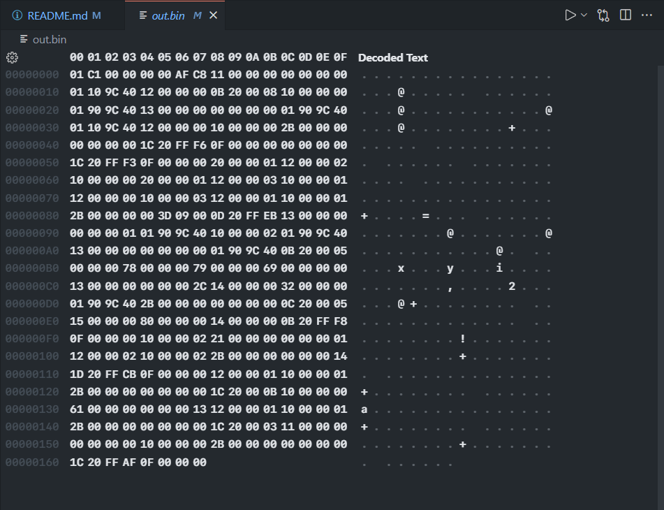
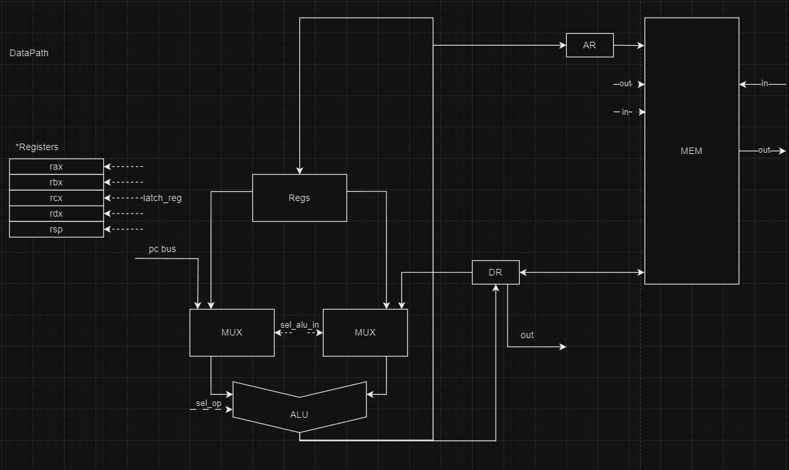
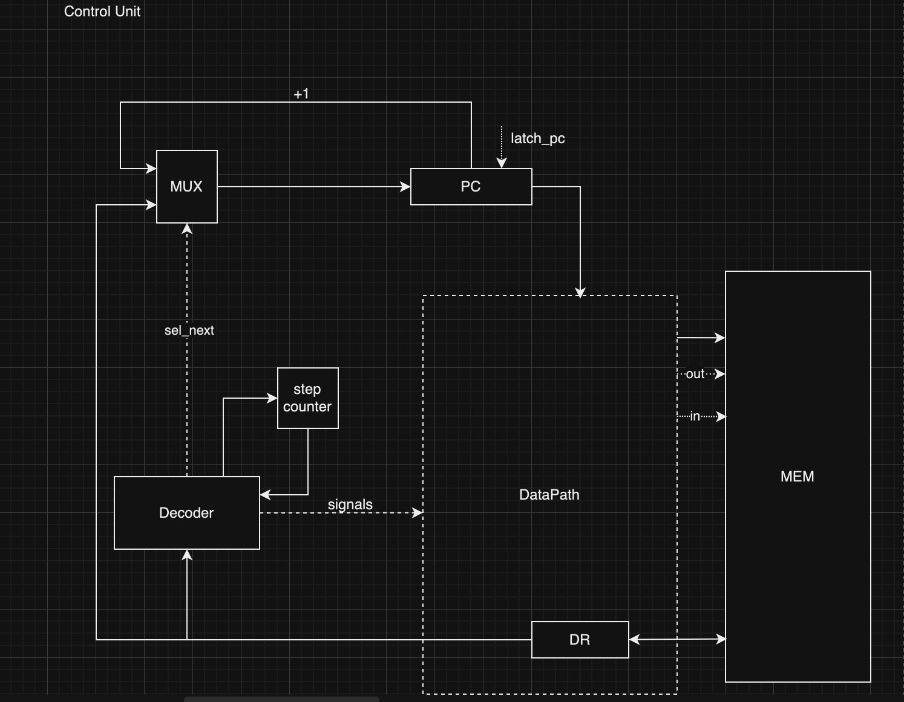

# csa-lab3

## Вариант 
```Калабухов Максим Александрович ```

```< alg | cisc | neum | hw | instr | binary | stream | mem | cstr | prob2 >```
| Особенность             |                                  |
|-------------------------|----------------------------------|
| alg                     | синтаксис языка должен напоминать java/javascript/lua.                               |
| cisc                    | Система команд должна содержать сложные инструкции, переменная длина машинного слова |
| neum                    | фон Неймановская архитектура.                                                        |
| hw                      | CU Реализуется как часть модели.                                                     |
| instr                   | процессор необходимо моделировать с точностью до каждой инструкции.                  |
| binary                  | бинарное представление.                                                              |
| stream                  | Ввод-вывод осуществляется как поток токенов.                                         |
| mem                     | memory-mapped                                                                        |
| cstr                    | Null-terminated (C string)                                                           |
| prob2                   |                                                                                      |


## Язык программирования 
- Грамматика:
``` ebnf
program ::=  <statements>
statements ::= <statement> | <statement> <statements>
statement ::=  (<asign> | <if_statement> | <loop_statement> | <op>) ";"
op ::= <litteral> | <number> |
             <op> "+" <op> | 
             <op> "-" <op> |
             <op> "/" <op> |
             <op> "%" <op> |
             <op> "*" <op> |
             <op> "==" <op>|
             <op> "or" <op>|
             <op> "and" <op>|
             <op> "!=" <op>|
             "(" <op> ")"  |
asign ::= <type> <litteral> "="  <op>  ";"         
type ::= "int" | "char"  
if_statement ::= "if" "(" <op> ")" "{"  <statements> { "else" '{' <statements> '}' } "}"
loop_statement ::= "while" "(" <op> ")" "{" <statements> "}"
number ::= [0-9]*
litteral ::= [a-bA-B][a-bA-B0-9]*
```
- Типизация: статическая
    int - целочисленный тип данных. Может принимать любое значение помещающееся в 4 байта.
    char - символный тип данных. Может принимать любое значение помещающееся в 4 байта.
    Строки храняться в памяти машины, как последовательный набор символов.
- Область видимости: Глобальная
- Переменные храняться в области памяти variables (см. Структура Памяти). Регеистр rbx хранит указатель на эту область памяти.

## Структура Памяти


```
 Registers
+--------------------------------------------------------------------------------------------+
| rax - регистр общего назначения                                                            |
+--------------------------------------------------------------------------------------------+
| rbx - регситр общего назначения                                                            |
+--------------------------------------------------------------------------------------------+
| rdx - регистр общего назначения                                                            |
+--------------------------------------------------------------------------------------------+
| rcx - регситр общего назначения                                                            |
+--------------------------------------------------------------------------------------------+
| rsp - регистр общего назначения                                                            |
+--------------------------------------------------------------------------------------------+
| rbx - регситр общего назначения                                                            |
+--------------------------------------------------------------------------------------------+

            Instruction & Data memory
+-----------------------------------------------+
|    0    :  programm start                     |  <-- IP, SP
|        ...                                    |
| 40000   :  data buffer                        |
|        ...                                    |
| 44999   :  data buffer                        |
|        ...                                    |
| 45000   :  variables                          | <-- %rbx ↓
|        ...                                    |               
| 59999   :  variables                          |
|        ...                                    |
| 65536   :^   stack                            |
+-----------------------------------------------+
```
- Память данных и команд общая
- Размер ячейки памяти - 32 бита. Соответственно, 64-ёх битные инстуркции храняться в двух последовательных ячейках памяти.
- 6 регистров общего назначения, а так же регистр  __DR__, в который считываются данные из памяти или записываются, и регистр __AR__, который хранит адрес ячейки, к которой идет обращение.
- Размер всех регистров - 32 бита, за исключением __AR__, размер которого равен 16 бит.

Память разделена на 4 условных блока:
1. Блок, куда загружается программа _(programm start)_
2. Блок, куда мапятся устройства ввода/вывода _(data buffer)_
3. Блок, где храняться переменные _(variables)_. 
4. Стек _(stack)_

``` 
Машинное слово - non-fixed 32 - 64 бит  : 
|1---   |2---   |3---  |4---  |5---  |6---  |7---  |8--- | opt:|9------- | 10------- | 11------- | 12------- | 
|    opcode     | cntrl| reg  |           adress         |     |                     value                   |
                | cntrl| reg  |           offset         |     |                     value                   |

                
```
- Структура машинного слова имеет переменную длину. 
- Длинна машинного слова определяется либо по _opcode_, либо по _управляющим битам (cntrl)_.
- Инструкции с длинной машинного слова 64 бита используются для прямой загрузки операнда. 
##### Вариации битов управления:

- control bits 0010 - относительная адрессация 
- control bits 0100 - косвенная адрессация 
- control bits mov 1001 - reg -> adress 
- control bits mov 1100 - reg <- immed.value
- control bits mov 0001 - reg <- adress

## Система команд
True Complex Instruction Set:

| mnemonic | opcode (HEX) | definition |
| ------  | ------------  | ----------- | 
| NOP | 00 | nop |
| MOV | 01 | move |
| ADD | 02 | summary |
| SUB | 03 | subtract |
| MUL | 04 | multiply |
| DIV | 05 | divide |
| MOD | 06 | mod_div |
| AND | 07 | logic and |
| OR | 08 | logic or |
| NOT | 09 | logic not |
| CMP | 0A | compare | 
| JMP | 0B | jump | 
| JZ | 0C | jump zero |
| JN | 0D | jump negative |
| JP | 0E | jump positive |
| HLT| 0F | halt |
| IMOV | 10 | move value by adress = rbp - value_offset to rax|
| MOVV | 11 | move absolute value to adress = rbp - var_offset |
| MOVA | 12 | move rax to adress = rbp - var_offset |
| MOVVA | 13 | move absolute value to rax |
| PUSHA | 14 | push rax value by rsp, rsp = rsp - 1 |
| POPA | 15 | pop value on rsp to rax, rsp = rsp + 1 |
| PEEKA | 16 | peek value from rsp to rax without changing rsp|
| ICMP | 1B | cmp value by adress = (rbp - value_offset) with rax|
| JNEQ | 1C | jump not equal|
| JNE | 1D | jump negative or equal|
| JPE | 1E | jump positive or equal |
| JNZ | 1F | jump not zero |
| CMPA | 2B | cmp rax with absolute value |
| IADD | 20 | summary rax with value by adress = rbp - value_offset|
| IADDVAL | 21 | summary rax with value  | 
| ISUB | 30 | subtract rax with value by adress = rbp - value_offset|
| ISUBVAL | 31 | substact rax with value  |
| IMOVSP | 32 | move operand from adress = rsp to rax |
| IMUL | 40 | multiply rax with value by adress = rbp - value_offset|
| IMULVAL | 41 | multiply rax with value  |
| IDIV| 50 | divide rax with value by adress = rbp - value_offset|
| IDIVVAL | 51 | divide rax with value  |
| IMOD | 60 | mod rax with value by adress = rbp - value_offset|
| IMODVAL | 61 | mod rax with value  |
| IAND | 70 | AND rax with value by adress = rbp - value_offset|
| IANDVAL | 71 | AND rax with value  |
| INC | 80 | inc rax | 

- Особенности процессора:
    - Машинное слово 32 - 64 бита.
    - Определение размера машинного слова происходит на цикле декодирования команды.
    - Работа с устройствами ввода вывода просходит через память.
    - Память процессора хранит команды в бинарном виде.
- Кодирование инструкций: 
  - Инструкции кодируются в бинаром формате в соответствии со структурой машинного слова _(см. Структура памяти)_. 
   
## Транслятор
- Интерфейс командной строки:```translator.py <input_file> <target_file> <debug_file>```. На вход принимается файл с исходным кодом, бинарный файл, в который будет производиться запись и откладочный файл.
- Исходный код перобразуется в поток токенов, на основе которых строиться ast-дерево.
- На этапе трансляции ast-дерева происходит линковка переменных. Дерево транслируеться в набор команд, представленных в бинарном виде в соответствии со структурой команды _(см. Структура памяти)_, c последующей записью в бинарный файл. Помимо этого, идет запись в человеко-читаемый откладочный файл. 
- Пример сгенерированного бинарого файла, открытого в hex editor-e:
  
- Пример откладочного файла:
  ```
    0 - 01c10000 - mov %rbx <- next 4 byte
    1 - 0000afc8 - 45000 
    2 - 11000000 - movv (rbp - 0) <- next 4 bytes
    3 - 00000000 - 0 
    4 - 01109c40 - mov %rax <- (40000)
    5 - 12000000 - mova %rax -> (rbp - 0)
    6 - 0b200008 - jmp %pc + 8
    7 - 10000000 - imov %rax <- (rbp - 0)
    8 - 01909c40 - mov %rax -> (40000)
    9 - 13000000 - movva %rax <- next 4 bytes
    10 - 00000000 - 0 
    11 - 01909c40 - mov %rax -> (40000)
    12 - 01109c40 - mov %rax <- (40000)
    13 - 12000000 - mova %rax -> (rbp - 0)
    14 - 10000000 - imov %rax <- (rbp - 0)
    15 - 2b000000 - cmpa
    16 - 00000000 - 0 
    17 - 1c20fff6 - jneq %pc + -10
    18 - 0f000000 - hlt
    ```

## Модель процессора 
Интерфейс командной строки:```machine.py <machine_code_file> <input_file>```. 


**DataPath**

Сигналы на схеме:
- ```latch_reg``` - записать значение в регистр ```x```
- ```sel_reg_wr``` - регистр для записи
- ```sel_op``` - выбор операции, производимой алу
- ```sel_alu_in``` - выбор регистра, подаваемого на вход АЛУ

Флаги в АЛУ:
- ___N___ - результат отрицателен
- ___Z___ - результат ноль


**ControlUnit**

- Hardwired
- В методе ```start_processering``` происходит работа машины. Внутри метода выполняеться цикл выборки команды и цикл декодирования, который, основываясь на ```opcode``` команды, делегирует выполнение функции _(которая в себе содержит operand ```fetch``` и ```execution fetch```)_, привязанной к этой команде.
- Каждая запись в журнале соответствует состоянию процессора после выполнения инструкции, для этого используется модуль ```logging```
- Остановка моделирования завершаеться, если 
  - Количество тактов превысило заранее заданный лимит
  - При выполнении ```hlt```

## Тестирование
 - [cat](./golden/cat.yml)
 - [hello world](./golden/hello_world.yml)
 - [hello user](./golden/hello_world_user.yml)
 - [prob2](./golden/prob2.yml) - сумма четных чисел, не превышающих 4 млн, последовательности Фиббоначи

  - Файл с тестами [test](./test/test.py). Тестирование работает через golden tests, которые можно найти в [golden](./golden/)

- CI
``` yml
name: Python CI

on:
  push:
    branches:
      - '*'

jobs:
  csa-lab-3:
    runs-on: [ubuntu-latest]

    steps:
    - name: Checkout code
      uses: actions/checkout@master

    - name: Set up Python
      uses: actions/setup-python@v3
      with:
        python-version: 3.12

    - name: Install dependencies
      run: |
        python -m pip install --upgrade pip
        pip install poetry
        poetry install

    - name: Run tests and coverage
      run: |
        poetry run coverage run -m pytest ./test/test.py
        poetry run coverage report -m

    - name: Check code formatting
      run: poetry run ruff format --check .

    - name: Run code linting
      run: |
        poetry run ruff check .
```
## Итог
```text
| ФИО                            | алг              |LoC | code байт | code инстр. | инстр. | такт. | вариант                                                               |
| Калабухов Максим Александрович | hello            | 1  | 120       | 13          | 122    | 424   | alg | cisc | neum | hw | instr | binary | stream | mem | cstr | prob2 |
| Калабухов Максим Александрович | cat              | 6  | 76        | 15          | 38     | 147   | alg | cisc | neum | hw | instr | binary | stream | mem | cstr | prob2 |
| Калабухов Максим Александрович | hello_user_name  | 8  | 220       | 37          | 122    | 445   | alg | cisc | neum | hw | instr | binary | stream | mem | cstr | prob2 |
| Калабухов Максим Александрович | prob2            | 15 | 176       | 33          | 562    | 2552  | alg | cisc | neum | hw | instr | binary | stream | mem | cstr | prob2 |
```

## *Вывод и размышления о работе:

 __В процессе выполнения работы, пришло осознание сложности компиляторов. Я прочувствовал эту сложность на себе. 
 Так же пришло осознание, на сколько СЛОЖНЫЙ декодер в cisc архитектуре, да и в целом isa cisc, потому что не редко за референсами пришлось лезть смотреть систему команд x86, а там мрак...
 В целом - моделирование своей машины - интерейснейшая задача, с которой я боролся 24/7 около двух недель. 
Бинарные данные в моей машины раскрыли дебаг для меня с новой стороны - теперь я мастерски управляю всеми хоткеями; чувствую себя пианистом в этот момент.
 Очень интересный опыт и со стороны понимания: конечно я и до этого слышал про абстрактные синтаксические деревья, да и был БЭВМ, как смоделированная машинка. Но написание этого своими руками закрепило понимание и расширило кругозор.__

